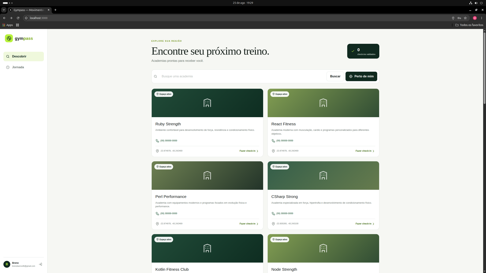
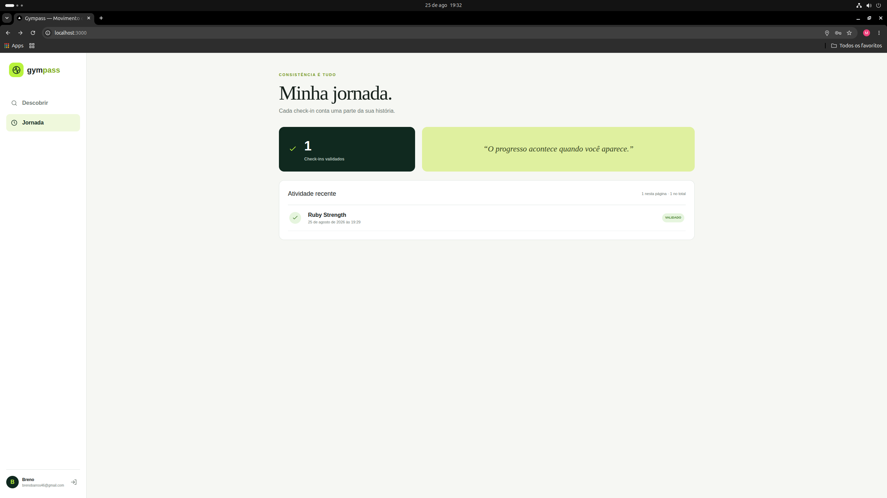
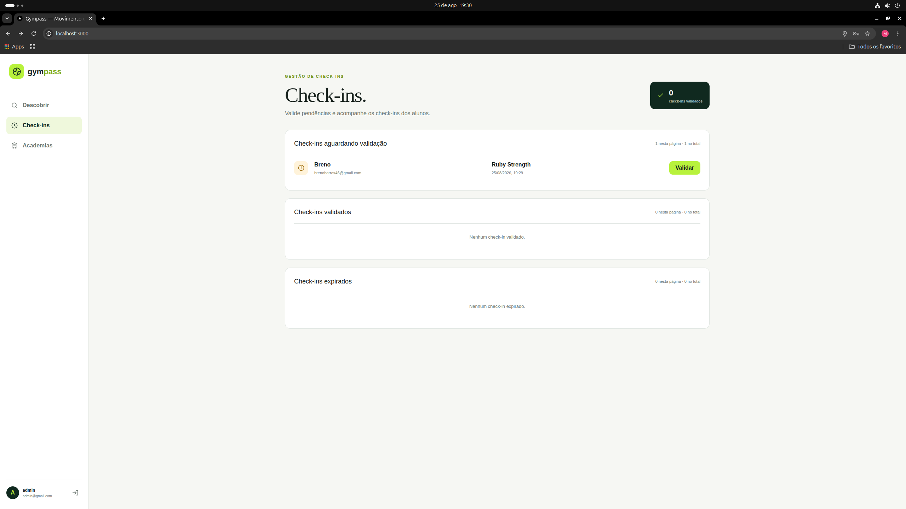
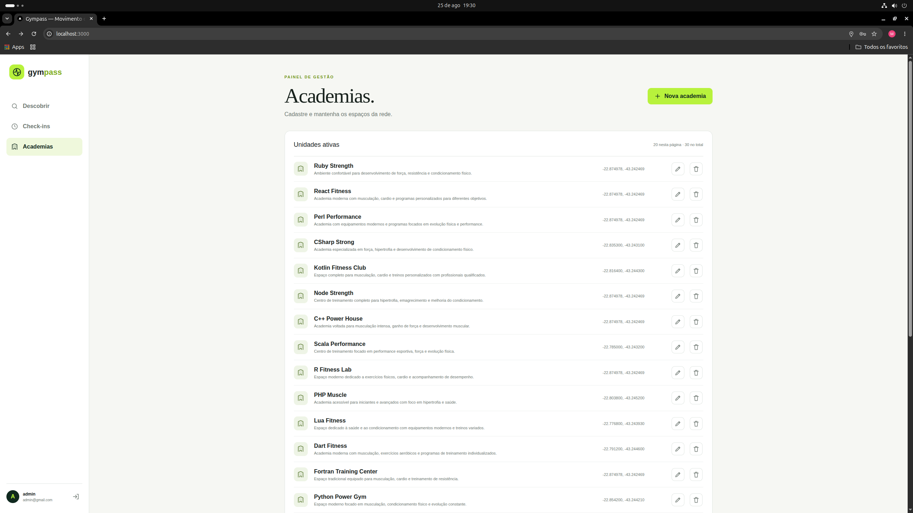
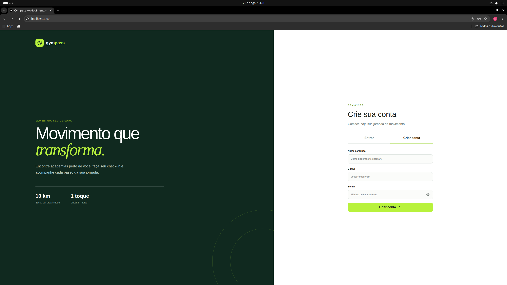
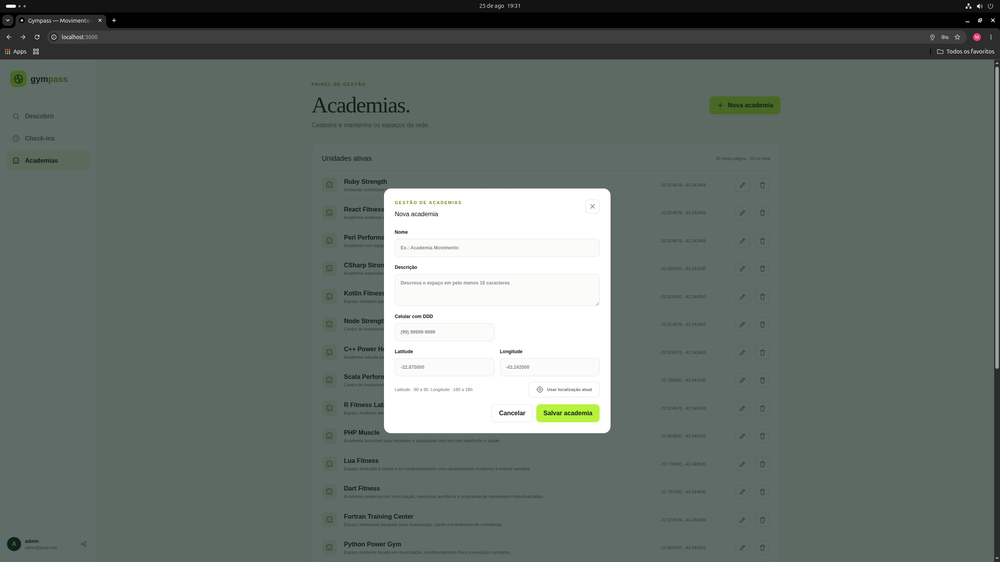
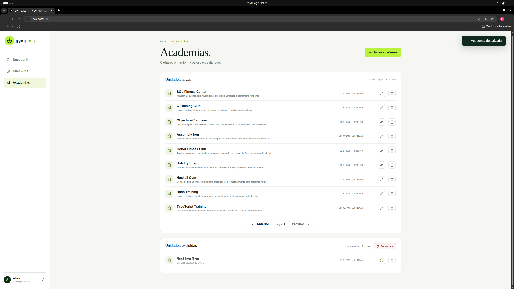

# GymPass Fullstack

Plataforma full-stack inspirada no GymPass para descoberta de academias, realização e validação de check-ins e gerenciamento administrativo.

O projeto foi desenvolvido com Next.js, Fastify, TypeScript, PostgreSQL e Prisma, aplicando conceitos como TDD, SOLID, arquitetura REST e integração contínua.

---

## Preview

### Descoberta de academias

Busca por nome ou proximidade, detalhes das unidades e check-in com geolocalização.



### Jornada do usuário

Histórico completo com status pendente, validado ou expirado e métricas pessoais.



### Área administrativa

Validação de check-ins e acompanhamento separado por status.



Gerenciamento paginado de academias, com totais, edição e exclusão.



### Outros fluxos

<details>
<summary>Cadastro de usuário</summary>



</details>

<details>
<summary>Cadastro de academia</summary>



</details>

<details>
<summary>Desativação e recuperação de academias</summary>



</details>

---

## Funcionalidades

### Usuário

- Cadastro de usuário.
- Autenticação com e-mail e senha.
- Autenticação utilizando JWT.
- Renovação de sessão.
- Visualização do perfil.
- Busca de academias por nome.
- Busca de academias próximas.
- Realização de check-in.
- Histórico de check-ins.
- Contagem de check-ins realizados.

### Administrador

- Cadastro de academias.
- Gerenciamento de academias.
- Validação de check-ins.
- Acesso a operações administrativas.

---

## Regras de negócio

- O usuário pode realizar apenas um check-in por dia.
- O check-in só pode ser realizado quando o usuário estiver a uma distância máxima de 100 metros da academia.
- O check-in deve ser validado em até 20 minutos após sua criação.
- Apenas usuários administradores podem validar check-ins.
- O e-mail utilizado no cadastro deve ser único.
- Academias podem ser buscadas pelo nome.
- Academias próximas podem ser encontradas utilizando a localização do usuário.

---

## Tecnologias

### Front-end

- Next.js
- React
- TypeScript
- Tailwind CSS

### Back-end

- Node.js
- Fastify
- TypeScript
- Prisma ORM
- PostgreSQL
- JWT

### Testes e infraestrutura

- Vitest
- Supertest
- Docker
- GitHub Actions
- Swagger / OpenAPI

### Conceitos aplicados

- TDD
- SOLID
- Repository Pattern
- Use Cases
- Separação de responsabilidades
- API REST
- CI/CD

---

## Estrutura do projeto

O projeto utiliza uma estrutura full-stack organizada dentro da pasta `apps`.

```text
apps/
├── api/
│   └── API REST desenvolvida com Node.js, Fastify, Prisma e PostgreSQL
│
└── web/
    └── Interface web desenvolvida com Next.js
```

---

## Arquitetura do Back-end

O back-end foi desenvolvido buscando separar as regras de negócio da infraestrutura da aplicação.

O fluxo principal funciona da seguinte forma:

```text
HTTP Request
     ↓
Controller
     ↓
Use Case
     ↓
Repository
     ↓
Prisma
     ↓
PostgreSQL
```

Essa separação facilita a manutenção, os testes e a substituição de implementações da camada de persistência.

---

## Documentação da API

A API possui documentação interativa utilizando Swagger/OpenAPI.

Após iniciar a API, a documentação pode ser acessada em:

```text
http://localhost:3333/docs
```

A documentação permite visualizar e testar os endpoints disponíveis, parâmetros, bodies, respostas e status codes da API.

---

## Principais endpoints

### Usuários

```http
POST /users
POST /sessions
```

### Perfil

```http
GET /me
```

### Academias

```http
POST /gyms
GET /gyms/search
GET /gyms/nearby
```

### Check-ins

```http
POST /gyms/:gymId/check-ins
GET /check-ins/history
GET /check-ins/metrics
PATCH /check-ins/:checkInId/validate
```

> Os endpoints podem sofrer alterações conforme a evolução do projeto.

---

## Testes

O projeto possui testes unitários e testes E2E utilizando Vitest.

Entre os cenários testados estão:

- Cadastro de usuário.
- Validação de e-mail duplicado.
- Autenticação.
- Recuperação do perfil.
- Busca de academias.
- Busca de academias próximas.
- Realização de check-in.
- Limite de um check-in por dia.
- Distância máxima permitida para check-in.
- Histórico de check-ins.
- Contagem de check-ins.
- Validação de check-in.
- Limite de 20 minutos para validação.

Para executar os testes:

```bash
npm run test
```

Para executar os testes E2E:

```bash
npm run test:e2e
```

---

## Executando o projeto

Clone o repositório:

```bash
git clone URL_DO_SEU_REPOSITORIO
```

Entre na pasta:

```bash
cd gympass-fullstack
```

---

## Executando a API

Entre na pasta da API:

```bash
cd apps/api
```

Instale as dependências:

```bash
npm install
```

Copie o arquivo de variáveis de ambiente:

```bash
cp .env.example .env
```

Inicie os serviços necessários utilizando Docker:

```bash
docker compose up -d
```

Execute as migrations:

```bash
npx prisma migrate dev
```

Inicie a API:

```bash
npm run dev
```

A API estará disponível em:

```text
http://localhost:3333
```

---

## Executando o Front-end

Em outro terminal, entre na pasta do front-end:

```bash
cd apps/web
```

Instale as dependências:

```bash
npm install
```

Copie as variáveis de ambiente:

```bash
cp .env.example .env.local
```

Inicie o projeto:

```bash
npm run dev
```

O front-end estará disponível em:

```text
http://localhost:3000
```

---

## Integração contínua

O projeto utiliza GitHub Actions para executar verificações automáticas durante o processo de desenvolvimento.

Os workflows podem incluir:

- Execução de testes.
- Verificação do build.
- Validação da aplicação.
- Automação do processo de integração contínua.

Os arquivos de configuração estão disponíveis em:

```text
.github/workflows
```

---

## Screenshots

As imagens utilizadas neste README estão organizadas em:

```text
docs/
└── images/
    ├── auth-register.png
    ├── member-discovery.png
    ├── member-journey.png
    ├── admin-checkins.png
    ├── admin-gyms.png
    ├── admin-create-gym.png
    └── admin-gym-lifecycle.png
```

---

## Status do projeto

🚧 Projeto em desenvolvimento.

Atualmente o projeto possui:

- Back-end com regras de negócio implementadas.
- Autenticação utilizando JWT.
- Controle de permissões entre membros e administradores.
- Testes unitários e E2E.
- Front-end desenvolvido com Next.js.
- Integração contínua com GitHub Actions.
- Documentação da API utilizando Swagger/OpenAPI.

---

## Autor

Desenvolvido por **Moisés Barros**.
